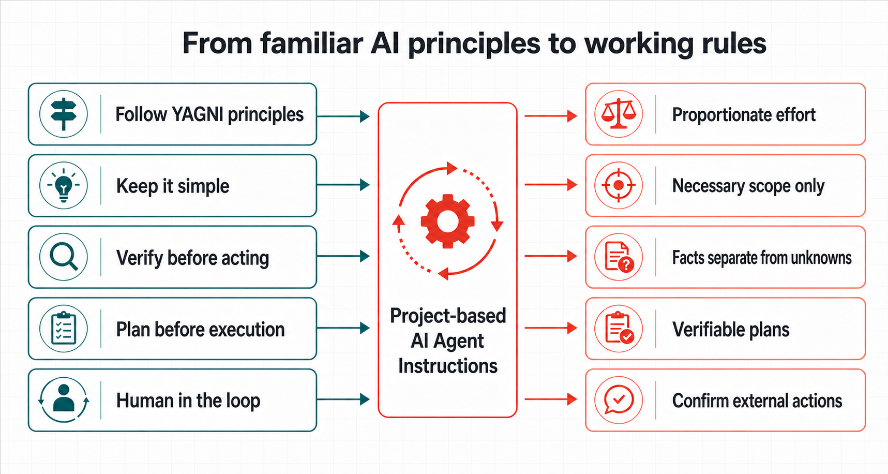

# Project-based AI Agent Instructions

*Adam's AI Instructions*

[繁體中文](README.md) · [English complete instruction](prompts/02-claude-code-meta-instruction/prompt.en.md) · [English guide](prompts/02-claude-code-meta-instruction/guide.en.html) · [Traditional Chinese complete instruction](prompts/02-claude-code-meta-instruction/prompt.md) · [Traditional Chinese guide](prompts/02-claude-code-meta-instruction/guide.html)

Once an AI can enter your project or workspace—read files, edit files, use tools, or prepare something for release—the question is no longer only whether its answers sound good. You need to know what it looked at, why it took an action, and how you can check the result.

This **complete global instruction** gives that kind of AI agent a way to work. Put it where your tool applies lasting instructions to a project or workspace. The agent first understands the task and the rules already in place, then gets on with the work. Small jobs stay simple. Work involving data, secrets, publication, or several connected changes comes with a clear account of the risk, outcome, and way to check it.

It is for Claude Code, OpenAI Codex, Cursor, Antigravity, and similar AI agents that can work inside a workspace you have authorized. Ordinary web chat is outside this project's scope.

## From familiar principles to working rules

You may already use `Follow YAGNI principles`, `Keep it simple`, `Verify before acting`, `Plan before execution`, or `Human in the loop`. They point in the right direction, but usually do not say when they apply, when they do not, or how an agent should show that it followed them.

Project-based AI Agent Instructions do not replace those principles, and do not claim endorsement by any company or expert. These instructions turn them into rules an agent can judge, carry out, and check:

| Familiar prompt direction | What these instructions make the agent do |
|---|---|
| `Follow YAGNI principles` / `Keep it simple` | Match effort to consequence, uncertainty, and reversibility; make the smallest complete necessary change. |
| `Verify before acting` | Read the source of truth first; separate facts, inferences, and what remains unverified. |
| `Plan before execution` | Require a verifiable plan only for dependent, consequential, or hard-to-recover work. |
| `Human in the loop` | Complete safe local work directly; require separate explicit authorization for pushing, publishing, deletion, access changes, and spending. |
| `Manage context` | Limit search and reading to the relevant scope, keep high-signal context, and avoid loading long rules or unrelated material together. |

[See the fuller mapping to these instructions and public guidance](prompts/02-claude-code-meta-instruction/README.en.md#from-familiar-principles-to-working-rules).

## What changes after you install it

Ask an agent to update a README and it should not edit on sight. It first looks for the existing style, the relevant rules, and a result it can read back afterwards. Then it changes only what is needed.

Ask it to research, organize information, or prepare a release and it separates verified facts from open questions and from choices that really need you. Deletion, overwrite, public release, access changes, and spending still wait for your final confirmation.

This does not turn every small task into a process. A clear, reversible fix can be completed directly. Extra checking is for work where an error would be harder to undo or would affect more than one thing.

## Start here

1. Open the right project or workspace in your AI tool. Do not begin by giving it an unrelated personal folder.
2. Choose the language you want the agent to use, then copy one complete instruction: [English complete instruction](prompts/02-claude-code-meta-instruction/prompt.en.md) or [Traditional Chinese complete instruction](prompts/02-claude-code-meta-instruction/prompt.md). This is the full set of global working rules for your AI agent, not sample text.
3. Paste the full text into the place where your tool keeps lasting instructions or rules for that project or workspace. Save it, then start a new task.
4. Try one small, real job: “Read this project’s rules and test instructions, then fix one typo in the README and read it back to confirm.”

In common tools, that place is usually called:

| Tool | Project instruction location |
|---|---|
| Claude Code | `CLAUDE.md` |
| OpenAI Codex | `AGENTS.md` |
| Cursor | `AGENTS.md` or Project Rules |
| Antigravity | Workspace Rule |

To see how the agent responds in four common situations, open the [English guide](prompts/02-claude-code-meta-instruction/guide.en.html) or [Traditional Chinese guide](prompts/02-claude-code-meta-instruction/guide.html).

## What the instruction protects

- Before changing something, the agent reads the rules, files, and direct context that matter to the task.
- In research, it separates sources, dates, facts, inferences, and material that is still unverified.
- After a write, it reads the result back. If it does not know a safe delivery location, it does not invent a parallel folder structure.
- An important plan explains how success will be proven, what remains after failure, and how recovery works.
- When a core source or safety condition is missing, the agent explains the block plainly instead of handing you a polished plan that is not safe to use.

## What it cannot decide for you

The instruction does not replace your tool's permissions, sandbox, version control, or backups. Having a prompt does not mean a system is already safe.

Public release, payment, pushing, deletion, access changes, and other irreversible actions still need your clear confirmation. The point is to help the agent make those decisions easier to see before you make them.

## Latest update: v0.9.0

When used with Agent Handoff Kit, the instruction now keeps the global prompt and handoff workflow responsibilities clearer. Creative work still stays lightweight, while real-world factual claims still need checking. [See what changed](docs/releases/v0.9.0.md)

## More to explore

- [English overview](prompts/02-claude-code-meta-instruction/README.en.md)
- [Traditional Chinese overview](prompts/02-claude-code-meta-instruction/README.md)
- [English interactive guide](prompts/02-claude-code-meta-instruction/guide.en.html)
- [Traditional Chinese interactive guide](prompts/02-claude-code-meta-instruction/guide.html)
- [Changelog](CHANGELOG.md)

## Optional: Agent Handoff Kit and Innovation Loop

These instructions work on their own. They govern how an agent judges, changes, and checks work in the current task.

For work that continues across several conversations or agents, [Agent Handoff Kit](https://adamchanadam.github.io/agent-handoff-kit/agent-handoff-kit-intro.html) can preserve the current state, handoff, and closeout information. For a longer project that needs to move from ideas through research and validation into a plan, see [Innovation Loop](https://github.com/Adamchanadam/agent-handoff-innovation-loop). They are useful additions when you need them, not prerequisites for using these instructions.

## License and feedback

This project is licensed under the [MIT License](LICENSE). If your experience differs from the guide, share the tool name, instruction location, and a reproducible scenario. Do not include secrets or private file content.
