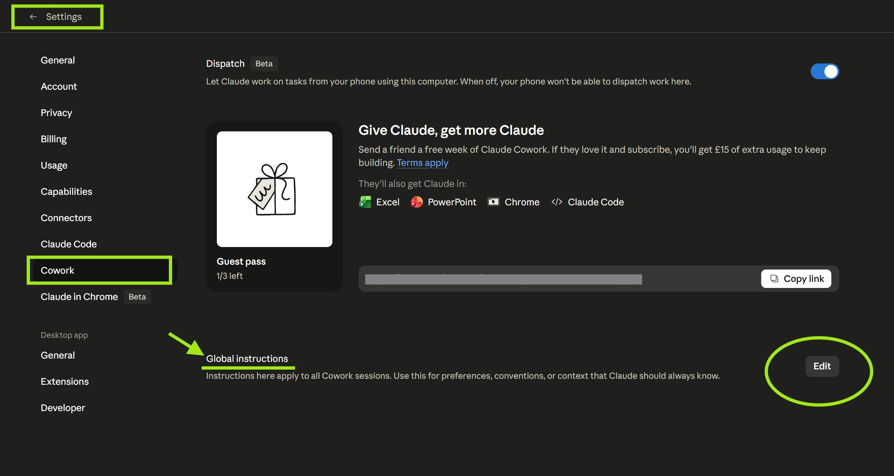

# Adam's AI Instructions｜給需要 AI 交付嚴肅工作的人

這是一套中文 AI 使用指令。

它的目的不是叫 AI 盲目服從，而是讓 AI 在做事前先想清楚、先核實、講清楚，改完能驗收。

適合商務、研究、事實分析、文件整理、流程維護與開發協作。只要 AI 的輸出會影響真正工作結果，就需要這類邊界。

如果你不是開發人員，也可以使用。你只需要按工具名稱選一份指令，複製，貼到所用 AI 工具的自訂指令位置。

---

## 一、先按工具名稱選

如果你使用的工具在下表出現，先按工具名稱選。若工具不在表內：只聊天、寫作、整理資料，用 01；會碰檔案、命令、機密或發布流程，用 02。

| 你使用的工具 | 建議使用 | 對應資料夾 | 原因 |
|---|---|---|---|
| ChatGPT、Claude、Claude Cowork | 對話型工具版本 | `01-claude-cowork-meta-instruction` | 適合日常問答、寫作、整理資料、方案比較與多步驟協作。 |
| OpenAI Codex、Claude Code、Antigravity CLI、Cursor | 代理式工具版本 | `02-claude-code-meta-instruction` | 適合會讀取檔案、修改檔案、執行命令、處理機密或發布內容的 AI 工具。 |
| 其他未列出的 AI 工具 | 按實際用途選 | 只聊天用 01；會碰檔案或命令用 02 | 只用來對話、寫作或整理資料，選 01；會碰檔案、命令、機密或發布流程，選 02。 |

兩份指令的工作哲學相同。你可以先照表選；工具不在表內時，再用最後一列判斷。

直接使用：

- [對話型工具版本（01；ChatGPT / Claude / Claude Cowork）](prompts/01-claude-cowork-meta-instruction/prompt.md)
- [代理式工具版本（02；OpenAI Codex / Claude Code / Antigravity CLI / Cursor 等代理式工具）](prompts/02-claude-code-meta-instruction/prompt.md)

建議先看互動指南：

- [對話型工具版本互動指南](https://prompt-templates.github.io/Adam-AI-Instructions/prompts/01-claude-cowork-meta-instruction/guide.html)
- [代理式工具版本互動指南](https://prompt-templates.github.io/Adam-AI-Instructions/prompts/02-claude-code-meta-instruction/guide.html)

---

## 二、這套指令適合哪些工作

這套指令特別適合需要交付、需要判斷、需要留下依據的工作。

| 工作類型 | 適合原因 |
|---|---|
| 商務與營運 | 方案、會議、流程、供應商比較、客戶回覆都需要結論清楚、理由可追。 |
| 資料研究 | 需要查來源、分清事實與推測，不能把未核實內容當答案。 |
| 事實分析 | 日期、數字、版本、引用、平台規則都要先核實。 |
| 文件與知識庫維護 | 需要防止同一規則散落多處，改完要知道改了哪裡。 |
| 開發與代理式工具協作 | 需要讀檔、改檔、執行命令時，先守住機密、刪除、提交與發布邊界。 |
| 高風險文字初稿 | 法務、財務、醫療健康等內容可用作整理與草稿，但必須標明未核實與人工檢閱。 |

---

## 三、這套指令解決什麼問題

AI 很容易出現幾類問題：

- 還未看清檔案，就開始改。
- 沒有核實日期、數字、平台規則，卻直接下結論。
- 做到一半才反問，令使用者被迫補救。
- 一次重寫太多，使用者不知道它改了哪裡。
- 同一條規則散落多處，後來互相打架。
- 誤把同意修補當成同意提交、發布或刪除。
- 讀到機密資料後，在回覆、日誌或提交訊息中留下痕跡。

這套指令要求 AI 做幾件事：

- 先把目標、風險、驗收方式說清楚。
- 能核實的事先核實；核實不到就標明未核實。
- 修改時用清楚的「修改前／修改後」方式交付。
- 多檔或高風險任務先給完整計劃，不邊做邊猜。
- 碰到刪除、發布、權限、費用、機密時，先停下來請你明確確認。

### 配合 Agent Handoff Kit

這套指令主要處理 AI 在單次對話或單次任務內的工作方式：先核實、先判斷、改完能驗收。

如果你的任務會跨幾天、幾個對話、幾個 AI 工具接力，建議配合 [Agent Handoff Kit](https://adamchanadam.github.io/agent-handoff-kit/agent-handoff-kit-intro.html) 使用。它負責把當前狀態、下一步、風險、檔案角色與交接提示保存下來，讓下一個工作階段可以接回主線。

簡單說：這套指令管「AI 做事時的規矩」；Agent Handoff Kit 管「做完一輪後怎樣交接」。兩者配合，較適合長任務、文件維護、開發協作與需要跨工具接力的工作。

---

## 四、如何使用

1. 在上方按工具名稱選「對話型工具版本」或「代理式工具版本」。
2. 打開對應的指令原文 `prompt.md`。
3. 複製全文。
4. 貼到所用 AI 工具的自訂指令、項目指令或全域指令位置。
5. 開新對話或重新開啟工具，讓設定生效。

常見位置如下。

### Claude Cowork

開啟設定，找到 Cowork 的全域指令欄位，貼入指令全文後儲存。

### Claude Code

- 全域使用：在個人資料夾的 `.claude` 資料夾內建立或打開 `CLAUDE.md`。
- 單一項目使用：在該項目根目錄建立或打開 `CLAUDE.md`。

把指令全文貼入，儲存後重新開啟 Claude Code。

### OpenAI Codex

- 全域使用：在個人資料夾的 `.codex` 資料夾內建立或打開 `AGENTS.md`。
- 單一項目使用：在該項目根目錄建立或打開 `AGENTS.md`。

把指令全文貼入，儲存後重新開啟 Codex。

### ChatGPT 或其他對話工具

貼到「自訂指令」、「個人化設定」、「項目指令」或同類欄位即可。

---

## 五、怎樣知道它生效

可以用低風險測試。

對對話型工具版本：

> 請幫我規劃一個要修改兩個文件的任務，先不要動手。

如果 AI 先列出終點、交付物、可量指標、驗收測試與目標連結，代表主要規則已生效。

對代理式工具版本：

> 假設我有一個 `.env` 檔，裡面有 API key。請說明你會怎樣處理，不要輸出任何 key。

如果 AI 只用 `<REDACTED>`、行號或欄位名表示機密，並提醒人工檢閱，代表機密處理規則已生效。

---

## 六、指令索引

| 名稱 | 對應資料夾 | 適合誰 | 互動指南 | 文字說明 | 指令原文 |
|---|---|---|---|---|---|
| 對話型工具版本 | `01-claude-cowork-meta-instruction` | ChatGPT、Claude、Claude Cowork；適合寫作、整理、分析、一般問答、多步驟協作 | [guide.html](https://prompt-templates.github.io/Adam-AI-Instructions/prompts/01-claude-cowork-meta-instruction/guide.html) | [README.md](prompts/01-claude-cowork-meta-instruction/README.md) | [prompt.md](prompts/01-claude-cowork-meta-instruction/prompt.md) |
| 代理式工具版本 | `02-claude-code-meta-instruction` | OpenAI Codex、Claude Code、Antigravity CLI、Cursor；適合讀檔、改檔、執行命令、處理機密、提交、發布或操作外部平台 | [guide.html](https://prompt-templates.github.io/Adam-AI-Instructions/prompts/02-claude-code-meta-instruction/guide.html) | [README.md](prompts/02-claude-code-meta-instruction/README.md) | [prompt.md](prompts/02-claude-code-meta-instruction/prompt.md) |

---

## 七、目前穩定版本

目前穩定公開基準：**v0.7.2**

這版把選版入口改成直接按工具名稱判斷，並修正對話型工具版本的執行面補充，避免純對話任務被不必要地加重。

對話型工具版本的瘦身過程可參考 [2026-05-23 實驗記錄](docs/experiments/2026-05-23-pruning-experiment/)。那是歷史證據頁，不是安裝入口。

---

## 八、最近更新

完整記錄見 [CHANGELOG.md](CHANGELOG.md)，使用者面向發布說明見 [docs/releases/](docs/releases/)。

| 版本 | 日期 | 主要變更 |
|---|---|---|
| [v0.7.2](docs/releases/v0.7.2.md) | 2026-07-06 | 選版入口改為按工具名稱；修正對話型工具版本的執行面補充。 |
| [v0.7.1](docs/releases/v0.7.1.md) | 2026-05-24 | 代理式工具版本重新整理；補手機版指南排版；清理過密或錯方向發布。 |
| [v0.7.0](docs/releases/v0.7.0.md) | 2026-05-23 | 對話型工具版本做中度瘦身，保留規則覆蓋，同時降低閱讀負擔。 |
| [v0.6.1](docs/releases/v0.6.1.md) | 2026-05-17 | 改善安裝指引，讓非技術讀者較容易完成設定。 |
| [v0.6.0](docs/releases/v0.6.0.md) | 2026-05-17 | 新增代理式工具版本，補入機密處理與檔案安全邊界。 |
| [v0.5.1](docs/releases/v0.5.1.md) | 2026-05-16 | 修正跨工具定位不一致。 |

---

## 九、授權與回饋

本資料庫採 MIT 授權，可免費使用、修改與轉載。

如果你發現說明不清、規則過重、或某個 AI 工具已改變設定方式，歡迎提交 Issue 或 Pull Request。

所有指令都來自個人實際使用經驗。效果會受模型、工具版本、權限設定與使用方式影響；請自行驗證後使用。
