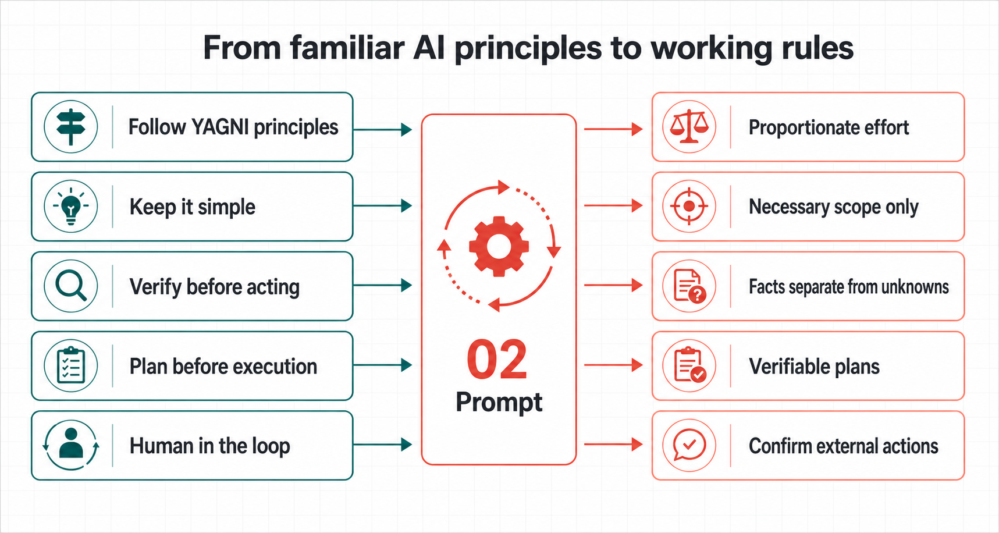

# 📖 How to use it

## v1.2.0 version

`prompt.md` and `prompt.en.md` are the published v1.2.0 complete instructions, replacing v1.1.0 as the latest public baseline. See the [v1.2.0 release record](https://github.com/prompt-templates/Adam-AI-Instructions/releases/tag/v1.2.0); the [v1.1.0 release record](https://github.com/prompt-templates/Adam-AI-Instructions/releases/tag/v1.1.0) remains available.

v1.2.0 explicitly names KISS, YAGNI, and fulfilling the user's requested outcome with the least rework. The user states needs, uses the result, and gives feedback; the AI owns research, technical choices, recovery, acceptance, and delivery. Authorized safe work continues, and local gaps block only dependent parts. Necessary execution outside the sandbox uses platform-permitted channels without asking again for valid authorization. Use the [Chinese text](prompt.md) or [English text](prompt.en.md) as one complete instruction.

## Overview

[Traditional Chinese overview](README.md) · [English prompt](prompt.en.md) · [English guide](https://prompt-templates.github.io/Adam-AI-Instructions/prompts/02-claude-code-meta-instruction/guide.en.html) · [Traditional Chinese prompt](prompt.md) · [Traditional Chinese guide](https://prompt-templates.github.io/Adam-AI-Instructions/prompts/02-claude-code-meta-instruction/guide.html) · [Home](../../README.en.md)

When an AI can enter your project or folder, the question is no longer only whether it gives a good answer. It can edit before it understands the rules, draw a conclusion from unchecked material, or say a job is finished halfway through.

These instructions give that kind of agent a clear way to work. The agent needs to understand the project and task before doing what needs doing. A small fix should not become a ceremony. But data, secrets, publication, and changes that affect each other need clear scope and impact before work begins, and a result you can check afterwards. Your tool's permissions—and any real decision to publish or make an irreversible change—remain yours.

## From familiar principles to working rules

This instruction does not provide built-in knowledge of research, code, law, or any industry. It governs how an agent uses the user's request, project files, tools, permissions, and checkable sources.

You may already use `Follow YAGNI principles`, `Keep it simple`, `Verify before acting`, `Plan before execution`, or `Human in the loop`. Those principles are useful, but on their own they usually do not define conditions, stopping points, or exceptions. These instructions turn them into working rules:

| Familiar prompt direction | What the short phrase leaves open | How these instructions make it operational |
|---|---|---|
| `Follow YAGNI principles` / `Keep it simple` | What can be omitted, and what is still required for this delivery. | Within the user goal and explicit scope, match effort to consequence, uncertainty, and reversibility. Include only issues that block acceptance, were caused by the change, or make the delivery inconsistent. Make the smallest sufficient related change, without letting persistence, sync, or governance expand the task automatically. |
| `Verify before acting` | What to verify, and what to do when sources conflict. | Check source coverage for complex work. Separate source, date, fact, inference, and what remains unverified. |
| `Plan before execution` | Whether small work needs a long plan, and when a plan is reliable. | Check complex work internally. Use a full-picture plan when major impact or complex dependencies need advance alignment, or the user asks. |
| `Human in the loop` | What safe work can proceed, and what must stop for approval. | Proceed with authorized, low-risk, reversible, no-side-effect work. Obtain appropriate explicit authorization for publishing, access changes, spending, and other external actions. Do not ask again for valid authorization; the complete instruction defines the temporary-artifact exception. |
| `Manage context` | How to avoid long rules, search output, and stale context interfering with each other. | Read known sources directly; use search/indexes for sources not yet located. Reuse valid evidence, preserve actual progress, and do not restart completed work during recovery. |

These directions align with public guidance from OpenAI, Anthropic, and Google: use direct, structured rules; remove repetition; and keep the high-signal material needed to complete the work. This is not an endorsement of these instructions by any of them. The instruction integrates public principles with failure modes observed in practical agent work into one usable rule set. References: [OpenAI model guidance](https://developers.openai.com/api/docs/guides/latest-model), [Anthropic context engineering](https://www.anthropic.com/engineering/effective-context-engineering-for-ai-agents), and [Google prompt design strategies](https://ai.google.dev/gemini-api/docs/prompting-strategies).

## What it helps with

v1.2.0 gives the AI responsibility for technical judgement and execution while retaining necessary safeguards. It reuses valid evidence and plans, scales checks to current risk, and stops after fulfilling agreed requirements.

- **Workplace**: for documents, fact checks, summaries, and local work updates, small tasks stay direct; long work first separates this turn's real output from the final outcome.
- **Creative**: writing, editing, naming, and visual direction are judged by the brief, tone, format, and constraints instead of engineering workflow; real-world claims still get checked.
- **Coding agent**: the agent reads the target and direct context, makes the smallest sufficient change, and handles stuck tools by checking for partial writes before choosing an authorized, safe recovery method.
- **Governance**: rule repairs identify sources and responsibilities and reuse established plans. Major impact or complex dependencies warrant a full-picture plan; necessary review follows the current operation or claim's risk.
- **Counter-review**: when a plan may affect safety, permissions, data integrity, public boundaries, or cross-surface promises, the agent looks for disconfirming cases before treating the plan as ready.

This repo provides the complete meta instruction only. Tool-specific config files, imports, and installation locations should follow that tool's documentation or your Agent Handoff Kit setup. Ordinary ChatGPT and Claude web chat are not supported here as reliable project agents.

## What changes after installation

- The agent finds the relevant files, rules, and acceptance path before changing code.
- Research separates source, date, fact, inference, and unknowns.
- A new file follows an existing project or platform location instead of inventing a folder.
- A write is read back; failure, interruption, or conflict cannot be reported as success.
- Complex work first anchors the task and checks necessary sources; show 🎯 level focus and diagrams only when ambiguity, risk, or a request warrants them.
- If a tool, sandbox, patch, or test is blocked, the AI diagnoses it and checks for partial writes, then chooses an authorized, safe, evidence-based remedy. Only necessary conditions it cannot supply are handed back to the user.
- External writes, release, access changes, and spending need appropriate explicit authorization, without asking again for valid permission. Reconstructable temporary artifacts created by the task may be cleaned up only under the complete instruction's narrow exception; secrets remain protected.
- A small edit stays short. A plan where a mistake would have a larger impact must survive an independent challenge before it is called executable.
- You do not receive a half-finished plan that still needs its main checks. If a core condition is missing, the agent explains the affected part and continuation conditions while proceeding with independent safe work.

## Fast setup

1. Copy [prompt.en.md](prompt.en.md).
2. Open the correct project or workspace.
3. Paste it where your tool keeps long-term project instructions or rules, save it, then start a fresh task.
4. Try one small real task: ask the agent to read project rules, correct one small mistake, and read it back.

Use the current official instructions or your Agent Handoff Kit setup for tool UI names and long-term instruction locations.

## It does not make every task complicated

The instruction matches effort to impact. A clear small fix can be completed and read back directly. Work involving data, secrets, public release, or several dependent changes gets the extra checks and confirmation it needs.

You do not need to understand how the rules were assembled. Paste the full instruction into your tool, then begin with one small, real task.
