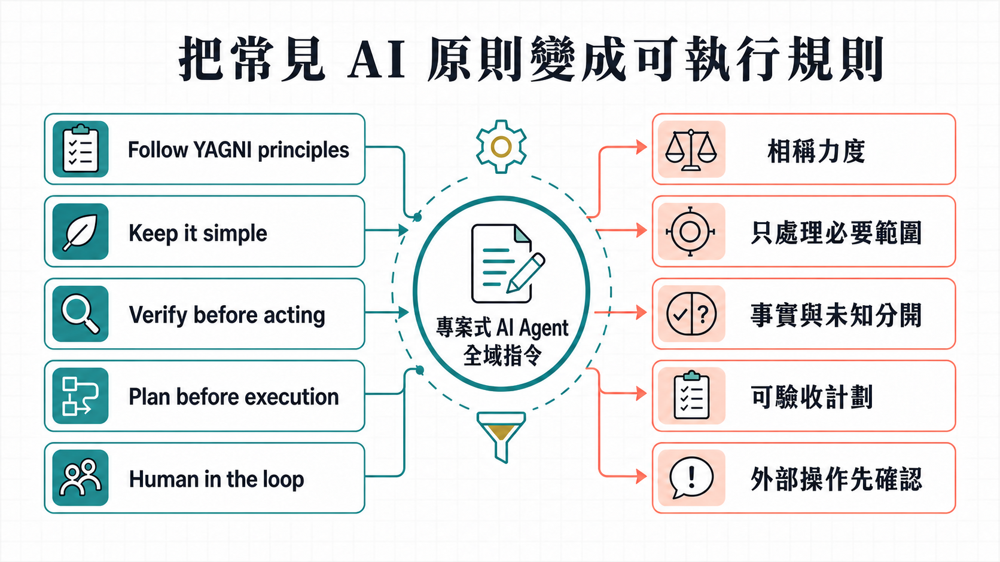

# 📖 使用說明

## v1.1.0 版本

`prompt.md` 與 `prompt.en.md` 是已發布的 v1.1.0 完整指令，已取代 v1.0.1 成為最新公開基準。版本說明見 [v1.1.0 發布記錄](https://github.com/prompt-templates/Adam-AI-Instructions/releases/tag/v1.1.0)；需要上一版時可查看 [v1.0.1 發布記錄](https://github.com/prompt-templates/Adam-AI-Instructions/releases/tag/v1.0.1)。

v1.1.0 合併重複規則，完整中英文正文均比修改前基準更短。保留七章、安全授權及答案資訊分層，並明確規定：已授權安全工作繼續做；來源缺口只阻擋依賴部分；選項沿用原標識、取捨不重複；準備或試行也須核實自身的執行條件。請使用 [繁中全文](prompt.md) 或 [英文全文](prompt.en.md)，不必拼接其他補充條文。互動指南已改為 v1.1.0 版本範圍。

## 使用說明

[English overview](README.en.md) · [繁中指令](prompt.md) · [中文指南](https://prompt-templates.github.io/Adam-AI-Instructions/prompts/02-claude-code-meta-instruction/guide.html) · [English prompt](prompt.en.md) · [English guide](https://prompt-templates.github.io/Adam-AI-Instructions/prompts/02-claude-code-meta-instruction/guide.en.html) · [主 README](../../README.md)

當 AI 可以進入你的專案或資料夾，問題不再只是它答得好不好。它可能未看清規則便改檔，未核實資料便下結論，或者做了一半便說任務完成。

「專案式 AI Agent 全域指令」是給這類 AI 的工作守則。它會先看清楚專案和任務，再做需要做的事；小修不用兜圈，牽涉資料、機密、發佈或多處互相影響的改動，會先說清範圍和影響，完成後讓你有方法核對。工具的權限和每次真正公開或不可逆的決定，仍然在你手上。

## 從熟悉原則到可執行規則

這份指令不提供研究、程式、法規或任何行業的內置知識。它規定 Agent 怎樣使用使用者要求、專案檔案、工具、權限和可核對來源。

你可能已見過 `Follow YAGNI principles`、`Keep it simple`、`Verify before acting`、`Plan before execution` 或 `Human in the loop`。這些原則有用，但單獨使用時，往往沒有說明適用條件、停止條件或例外。這份指令把它們深化成下列工作規則：

| 熟悉的提示方向 | 單句口號未說清的事 | 這份指令的落地方式 |
|---|---|---|
| `Follow YAGNI principles` / `Keep it simple` | 甚麼可省略，甚麼仍是本次交付必需。 | 在使用者目標與明示範圍內，按後果、未知與可回復性決定力度；只處理阻礙驗收、由修改造成或令交付矛盾的問題；作最小足夠的相關修改，不因持久化、同步或治理自動擴張任務。 |
| `Verify before acting` | 核實甚麼、來源衝突怎樣處理。 | 複雜任務先過真源覆蓋；區分來源、日期、事實、推論及未核實內容。 |
| `Plan before execution` | 小事會否也被迫寫長計劃；計劃怎樣才算可靠。 | 長任務先做層級對焦；只有對準且屬依賴、高影響、難恢復或外部副作用等情況，才使用全圖計劃。 |
| `Human in the loop` | 哪些安全工作可自主做，哪些操作必須停下。 | 已授權、低風險、可回復、無外部副作用的步驟可直接執行；發布、刪除、權限、費用及其他外部動作另取明確授權。 |
| `Manage context` | 怎樣避免長規則、搜尋結果和舊脈絡互相干擾。 | 先以搜尋、索引和抽樣建立範圍，再讀直接相關內容；長期工作分開保存交接狀態。 |

這些方向與 OpenAI、Anthropic、Google 的公開建議一致：規則要直接、有結構、避免重複，並保留完成工作所需的高訊號內容。這不是任何一方對這份指令的認證；它是把公開原則與實際 Agent 工作中的失敗模式整合成一份可使用的規則。參考：[OpenAI model guidance](https://developers.openai.com/api/docs/guides/latest-model)、[Anthropic context engineering](https://www.anthropic.com/engineering/effective-context-engineering-for-ai-agents)、[Google prompt design strategies](https://ai.google.dev/gemini-api/docs/prompting-strategies)。

## 它會怎樣幫你

v1.1.0 把讀真源、對焦、授權、執行及驗收的責任分開，將重複規則合併到負責章節。複雜工作先確認目標與必要來源；獨立安全工作保持續行，簡單工作不增加儀式化流程。

- **Workplace**：整理文件、查證資料、準備摘要或更新本地工作內容時，小事可直接完成；長任務先分清本輪真正產出。
- **Creative**：創作、改稿、命名和視覺方向按題意、語氣、格式和禁忌驗收，不硬套工程流程；涉及真實聲稱仍會核對。
- **Coding agent**：讀待改位置與直接上下文，做最小足夠修改，工具卡住時先確認沒有半寫入，再用同等安全通道重試一次。
- **Governance**：規則修補先分清真源和責任範圍；高風險或多階段工作先做層級對焦與真源覆蓋檢查，對準後才進入全圖計劃和獨立反證。
- **反證審閱**：對可能影響安全、權限、資料完整性、公開邊界或跨表面承諾的方案，先找能推翻方案的反例，不把未查漏計劃包裝成完成品。

這份 repo 只提供完整 meta instruction；各工具的設定檔、匯入方式和安裝位置，請依該工具或你的 Agent Handoff Kit 設定處理。不支援把一般網頁版 ChatGPT 或 Claude 對話當作可靠的專案代理工具。

## 貼入後，你會看到甚麼不同

- 改程式前，AI 先找相關檔案、既有規則與驗收方法。
- 研究不把估算寫成事實，會標出來源、日期、推論與未知。
- 新檔案不會擅自假定固定資料夾；先沿用專案或平台已指定的位置。
- 寫入後會讀回；出錯、中斷或衝突不能假裝成功。
- 複雜工作先做任務錨定與必要真源覆蓋；有歧義、風險或要求時才展示 🎯 層級對焦及圖表。
- 工具、沙盒、補丁、測試或讀取命令卡住時，會先確認沒有半寫入；只有同等安全、已授權、可審計的官方通道才可重試一次。
- 刪除、覆寫、發佈、權限、費用與機密有額外確認門檻。
- 單檔小修保持簡短；一旦出錯會有較大影響的計劃要先經獨立反證，才可稱為可執行。
- 你不會先收到一份未查漏的半成品計劃；核心條件補不齊時，AI 會說明受阻部分及續行條件，並繼續獨立安全工作。

## 最短安裝方法

1. 複製 [prompt.md](prompt.md) 全文。
2. 先進入正確的專案／工作區。
3. 貼到你的工具用來長期套用專案指令或規則的位置，儲存後重新開任務。
4. 先用一個小工作確認：要求 AI 讀專案規則，再修正一處小錯並讀回核對。

各工具的畫面、名稱和長期指令位置會更新，請以該工具的官方當前文件或你的 Agent Handoff Kit 設定為準。

## 不會令每件事變複雜

這份指令會按工作影響決定力度。明確的小修直接完成並讀回；涉及資料、機密、公開發佈或多個互相影響的改動，才會多做必要的核對與確認。

你不需要了解背後規則怎樣整理。只要把全文貼到工具內，用一件小而真實的工作開始即可。
